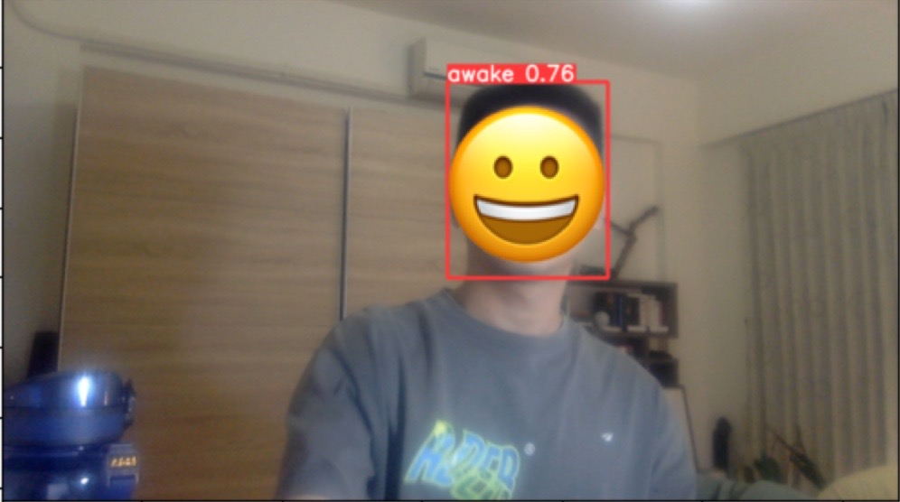

# Drowsiness-Detection-using-Yolo
RCNN開創了物件偵測的先鋒，接續又出現了Fast RCNN與Faster RCNN，但以上的演算法具有以下缺點：使用選擇性搜索（Selective Search）、不屬於端到端的演算法、使用多種模型等。而在2016年，[YOLO（You Only Look Once）](https://www.cv-foundation.org/openaccess/content_cvpr_2016/papers/Redmon_You_Only_Look_CVPR_2016_paper.pdf)的問世解決了上述提到的問題。

原本的物件偵測任務皆是透過分類器進行分類，但在YOLO中則是將其視為回歸任務。YOLO將輸入影像切割成```SxS```的grid cell，並從這些grid cell中找出邊界框（Bounding Box）並計算出類別的機率。整個過程只使用了一個神經網路，因此可視為一個End-to-End的演算法。

這樣的架構使整個偵測過程十分快速，可達到即時每秒45幀。而另外一個較小型的Fast YOLO不僅可達到每秒155幀的執行速度，mAP ( Mean Average Precision ) 也是其他即時物件偵測系統的兩倍。之後作者也發表了一系列的YOLO模型（v2, v3,...）。本篇文章不會深入介紹其背後架構與技術，而是專注於介紹如何將YOLO應用於實際技術中。如對YOLO有興趣的人可以參考：[YOLO演進](https://medium.com/ching-i/yolo演進-2-85ee99d114a1)、[一文弄懂YOLO算法](https://zhuanlan.zhihu.com/p/52661111)、[圖解一階段物件偵測算法](https://youtu.be/sq_OfIhb5Oc?si=_DSNkeWUBJBch63T)。

# **本篇文章的目的**
- 透過LabelImg標註自己的資料，並製作訓練集
- 使用custom dataset建立打瞌睡偵測模型

**How it works**
- Install and Import Dependencies
- Load Model
- Make Detections
- Real Time Detections
- Collect Images
- LabelImg
- Train from Scratch
- Testing

# Result


# 參考資料
[YOLO v5](https://github.com/ultralytics/yolov5.git)
[LabelImg](https://github.com/HumanSignal/labelImg.git)
[Deep Drowsiness Detection using YOLO, Pytorch and Python](https://youtu.be/tFNJGim3FXw?si=OZH1QIqIxVB4e5vM)

詳細文章可至[Hackmd](https://hackmd.io/@chrish0729/HJumJZ4Mp)觀看
